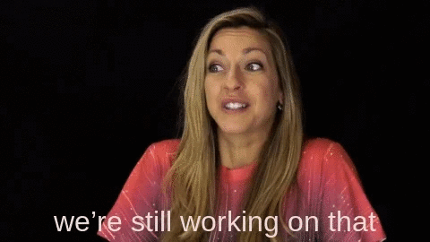

# Quarantine Stories

The idea of this project is for users to document your journey during quarentine and for indivituals to share their experiences during this tough time - 2020.

## Project specifications

The UI of this project is adapted from [liFEsTlye](https://www.behance.net/gallery/14554909/liFEsTlye-Mobile-version) by [Nelson Sakwa](https://www.behance.net/sakwadesignstudio) and the project specs by Microvers are available [here](https://www.notion.so/Lifestyle-articles-b82a5f10122b4cec924cd5d4a6cf7561)

## This project is still in process. Please check back later

