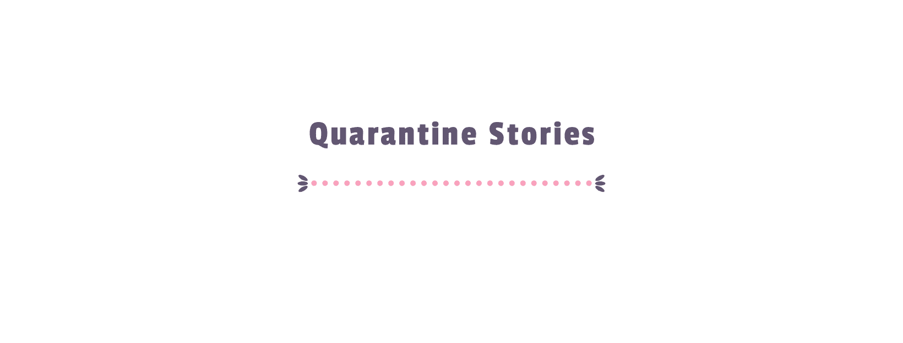
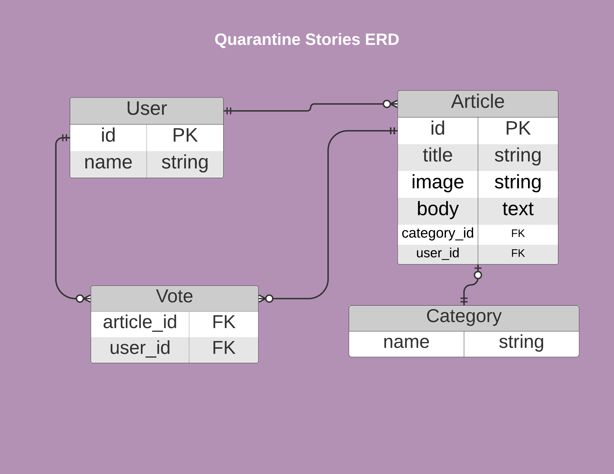

# Quarantine Stories

[![Contributors][contributors-shield]][contributors-url]
[![Forks][forks-shield]][forks-url]
[![Stargazers][stars-shield]][stars-url]
[![Issues][issues-shield]][issues-url]

The idea of this project is for users to document your journey during quarentine and for indivituals to share their experiences during this tough time - 2020.

## Project specifications

The UI of this project is adapted from [liFEsTlye](https://www.behance.net/gallery/14554909/liFEsTlye-Mobile-version) by [Nelson Sakwa](https://www.behance.net/sakwadesignstudio) and the project specs by Microvers are available [here](https://www.notion.so/Lifestyle-articles-b82a5f10122b4cec924cd5d4a6cf7561)

## About the project

- This project consists of bulding the "frienship" functionality on top of an existing repo.
- Project Links
  - Production link: [Production link](https://quarantine-stories.herokuapp.com/)
  - Staging Link: [Staging  link](https://infinite-retreat-30494.herokuapp.com/)
  - PR deployment link: [deployment link](https://quarantine-s-feature-st-ssqn8p.herokuapp.com/)

## Data Model

<!-- .element style="width=100px;" -->

## Requirements

- Once you download the project, please make sure that you have [Ruby](https://www.ruby-lang.org/en/) installed.
- Install `rails 5.2.3` if you haven't already. You could run the command `gem install rails -v '5.2.3'` to install rails.
- Make sure to run `bundle` command in the terminal once you are in the working directory.

## Features

TBA

## Technologies Used

- This project utilizes the Rails framework.

<!-- 

## Testing

## Test Output

-->

## Contributors

- Moin Khan
  - LinkedIn : [@MoinKhanIF](https://www.linkedin.com/in/moinkhanif/)
  - Personal Website: [MoinKhan.Info](https://moinkhan.info)
  - Twitter: [@MoinKhanIF](https://twitter.com/MoinKhanIF)
  
<!-- MARKDOWN LINKS & IMAGES -->

[contributors-shield]: https://img.shields.io/github/contributors/moinkhanif/quarantine-stories.svg?style=flat-square
[contributors-url]: https://github.com/moinkhanif/quarantine-stories/graphs/contributors
[forks-shield]: https://img.shields.io/github/forks/moinkhanif/quarantine-stories.svg?style=flat-square
[forks-url]: https://github.com/moinkhanif/quarantine-stories/network/members
[stars-shield]: https://img.shields.io/github/stars/moinkhanif/quarantine-stories.svg?style=flat-square
[stars-url]: https://github.com/moinkhanif/quarantine-stories/stargazers
[issues-shield]: https://img.shields.io/github/issues/moinkhanif/quarantine-stories.svg?style=flat-square
[issues-url]: https://github.com/moinkhanif/quarantine-stories/issues
